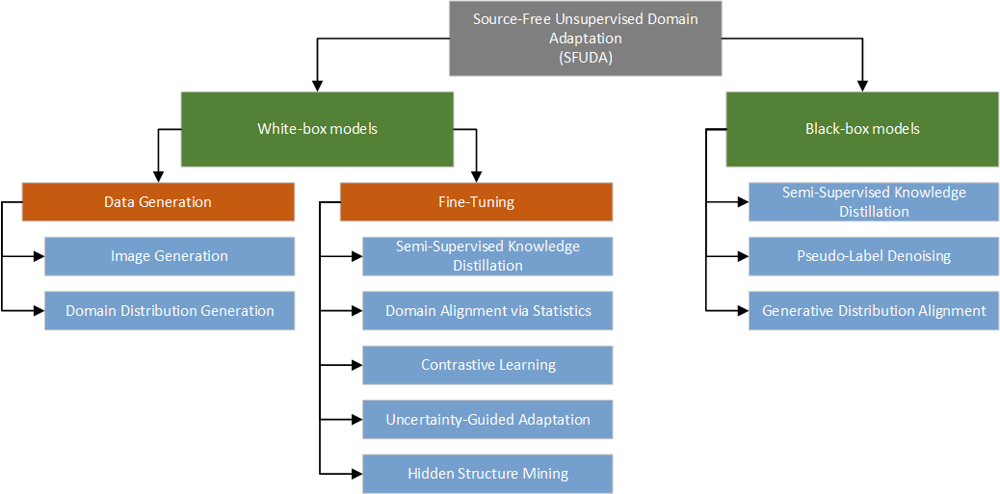
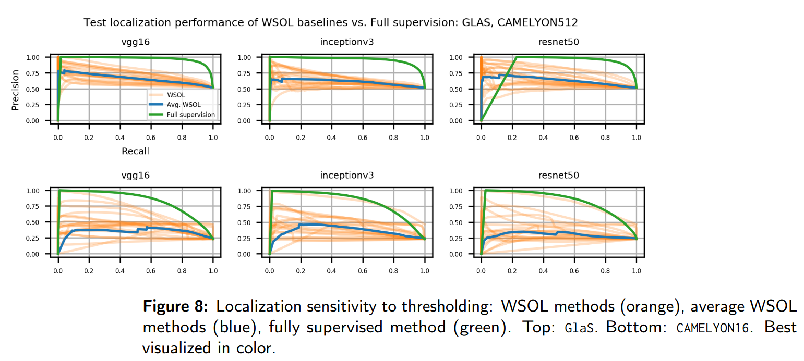
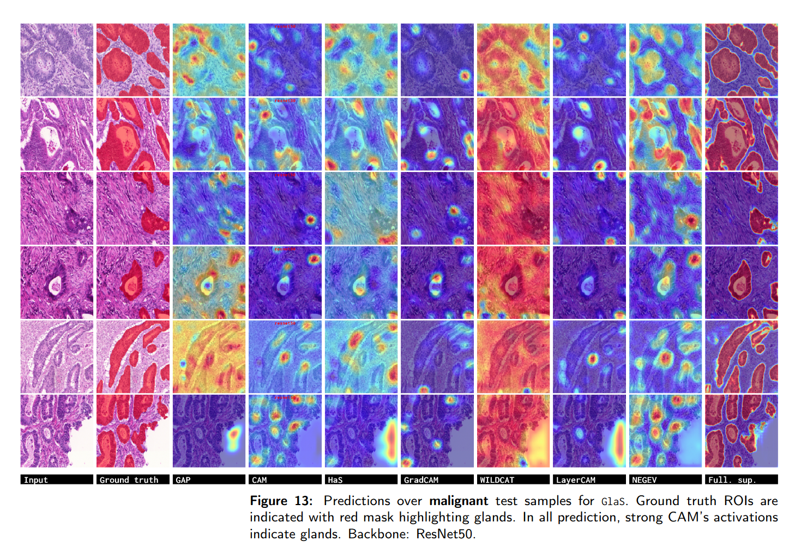

# [Source-Free Domain Adaptation of Weakly-Supervised Object Localization Models for Histology (CVPRw 2024)](https://arxiv.org/pdf/2404.19113.pdf)
by **Alexis Guichemerre<sup>1</sup>, Soufiane Belharbi<sup>1</sup>, Tsiry Mayet<sup>2</sup>, Shakeeb Murtaza<sup>1</sup>, Pourya Shamsolmoali<sup>3</sup>, Luke McCaffrey<sup>4</sup>, Eric Granger<sup>1</sup>**
<br/>
<sup>1</sup> LIVIA, Dept. of Systems Engineering, ÉTS, Montreal, Canada
<br/>
<sup>2</sup> LITIS UR 4108, F-746000, INSA Rouen Normandie, France
<br/>
<sup>3</sup> SEECS, Queen’s University Belfast, UK
<br/>
<sup>4</sup> Goodman Cancer Research Centre, Dept. of Oncology, McGill University, Montreal, Canada

## Abstract

Given the emergence of deep learning, digital pathology
has gained popularity for cancer diagnosis based on his-
tology images. Deep weakly supervised object localization
(WSOL) models can be trained to classify histology images
according to cancer grade and identify regions of interest
(ROIs) for interpretation, using inexpensive global image-
class annotations. A WSOL model initially trained on some
labeled source image data can be adapted using unlabeled
target data in cases of significant domain shifts caused by
variations in staining, scanners, and cancer type. In this pa-
per, we focus on source-free (unsupervised) domain adap-
tation (SFDA), a challenging problem where a pre-trained
source model is adapted to a new target domain without
using any source domain data for privacy and efficiency
reasons. SFDA of WSOL models raises several challenges
in histology, most notably because they are not intended to
adapt for both classification and localization tasks. In this
paper, 4 state-of-the-art SFDA methods, each one repre-
sentative of a main SFDA family, are compared for WSOL
in terms of classification and localization accuracy. They
are the SFDA-Distribution Estimation, Source HypOthesis
Transfer, Cross-Domain Contrastive Learning, and Adap-
tively Domain Statistics Alignment. Experimental results on
the challenging Glas (smaller, breast cancer) and Came-
lyon16 (larger, colon cancer) histology datasets indicate
that these SFDA methods typically perform poorly for local-
ization after adaptation when optimized for classification.

### Issues:
Please create a github issue.

### Content:
* [View](#view)
* [Requirements](#re2q)
* [Datasets](#datasets)
* [Run code](#run)


#### <a name='view'> Method</a>:
<!--  -->



Implemented WSOL methods:
- GAP
- Max-Pooling
- LSE
- CAM
- HaS
- WILDCAT
- ACoL
- SPG
- Deep MIL
- PRM
- ADL
- CutMix
- TS-CAM
- MAXMIN  -- Please use the original implementation https://github.com/sbelharbi/deep-wsl-histo-min-max-uncertainty
- NEGEV
- GradCAM
- GradCAM++
- Smooth-GradCAM++
- LayerCAM
- U-Net

Implemented SFUDA methods:
- SFDA-DE [[paper]](https://arxiv.org/abs/2204.11257)
- SHOT [[paper]](https://arxiv.org/abs/2002.08546)
- CDCL [[paper]](https://arxiv.org/abs/2106.05528)
- AdaDSA [[paper]](https://ieeexplore.ieee.org/document/9684410)

These methods have been integrated with all CAM-based methods except maxmin, 
negev, and fcam. The integration covers all architectures: Resnet50, VGG16, 
InceptionV3.
<!-- 
#### <a name='results'> Results</a>:








 -->


#### <a name='reqs'> Requirements</a>:

Quick installation to create a virtual environment using conda:
```bash
./make_venv.sh NAME_OF_YOUR_VENV
```

* [Full dependencies](dependencies/requirements.txt)
* Build and install CRF:
    * Install [Swig](http://www.swig.org/index.php)
    * CRF (not used in this work, but it is part of the code.)

```shell
cdir=$(pwd)
cd dlib/crf/crfwrapper/bilateralfilter
swig -python -c++ bilateralfilter.i
python setup.py install
cd $cdir
cd dlib/crf/crfwrapper/colorbilateralfilter
swig -python -c++ colorbilateralfilter.i
python setup.py install
```

#### <a name="datasets"> Download datasets </a>:
#### 2.1. Links to dataset:
* [GlaS](https://warwick.ac.uk/fac/sci/dcs/research/tia/glascontest)
* [Camelyon16](https://github.com/jeromerony/survey_wsl_histology)


#### 2.2. Download datasets:

* GlaS: [./download-glas-dataset.sh](./download-glas-dataset.sh).

You find the splits in [./folds](./folds).


### 2.3 Code for datasets split/sampling (+ patches sampling from WSI):
* See [datasets-split](https://github.com/jeromerony/survey_wsl_histology/tree/init-branch/datasets-split).
* Detailed documentation: [datasets-split/README.md](https://github.com/jeromerony/survey_wsl_histology/blob/init-branch/datasets-split/README.md).

#### <a name="run"> Run code </a>:

E.g. SHOT method via CAM WSOL method.

1- Train on source data CAMELYON512:

* CAM-method: CAM over CAMELYON512 using ResNet50:
```shell
#!/usr/bin/env bash 
 
CONDA_BASE=$(conda info --base) 
source $CONDA_BASE/etc/profile.d/conda.sh
conda activate da

# ==============================================================================
cudaid=$1
export CUDA_VISIBLE_DEVICES=$cudaid

export OMP_NUM_THREADS=50
python main.py \
       --task STD_CL \
       --encoder_name resnet50 \
       --arch STDClassifier \
       --spatial_dropout 0.1 \
       --runmode search-mode \
       --opt__name_optimizer sgd \
       --batch_size 32 \
       --eval_batch_size 64 \
       --eval_checkpoint_type best_localization \
       --opt__step_size 5 \
       --opt__gamma 0.1 \
       --max_epochs 20 \
       --freeze_cl False \
       --support_background True \
       --method CAM \
       --spatial_pooling WGAP \
       --dataset CAMELYON512 \
       --fold 0 \
       --cudaid $cudaid \
       --debug_subfolder None \
       --amp True \
       --opt__lr 0.001 \
       --sf_uda False \
       --exp_id 01_12_2024_09_23_52_900932__4871059
```

From the folder of the experiment `01_02_2024_09_23_52_900932__4871059`, 
copy one of the checkpoints folders to the folder `source_models` (constants.
SOURCE_MODELS_FD) located here `./source_models`: 
`CAMELYON512-0-resnet50-CAM-WGAP-cp_best_localization` or 
`CAMELYON512-0-resnet50-CAM-WGAP-cp_best_classification`.

2- Train on target data GLAS: 
#### E.g. of SHOT method.
```shell
#!/usr/bin/env bash 
 
CONDA_BASE=$(conda info --base) 
source $CONDA_BASE/etc/profile.d/conda.sh
conda activate da

# ==============================================================================
cudaid=$1
export CUDA_VISIBLE_DEVICES=$cudaid

export OMP_NUM_THREADS=50
python main.py \
       --task STD_CL \
       --encoder_name resnet50 \
       --arch STDClassifier \
       --spatial_dropout 0.1 \
       --runmode search-mode \
       --opt__name_optimizer sgd \
       --batch_size 32 \
       --eval_batch_size 64 \
       --eval_checkpoint_type best_localization \
       --opt__step_size 5 \
       --opt__gamma 0.1 \
       --max_epochs 1000 \
       --freeze_cl False \
       --support_background True \
       --method CAM \
       --spatial_pooling WGAP \
       --dataset GLAS \
       --fold 0 \
       --cudaid $cudaid \
       --debug_subfolder None \
       --amp True \
       --opt__lr 0.001 \
       --sf_uda True \
       --sf_uda_source_ds CAMELYON512 \
       --sf_uda_source_ds_fold 0 \
       --sf_uda_source_encoder_name resnet50 \
       --sf_uda_source_checkpoint_type best_localization \
       --sf_uda_source_wsol_method CAM \
       --sf_uda_source_wsol_arch STDClassifier \
       --sf_uda_source_wsol_spatial_pooling WGAP \
       --shot True \
       --shot_freq_epoch 1 \
       --shot_dist_type cosine \
       --ent_pseudo_lb True \
       --ent_pseudo_lb_lambda 0.3 \
       --div_pseudo_lb True \
       --div_pseudo_lb_lambda 0.1 \
       --ce_pseudo_lb True \
       --ce_pseudo_lb_lambda 0.3 \
       --ce_pseudo_lb_smooth 0.1 \
       --exp_id 01_12_2024_09_25_14_467534__5485897
```

#### E.g. of SFDA-DE method.
```shell
#!/usr/bin/env bash 
 
CONDA_BASE=$(conda info --base) 
source $CONDA_BASE/etc/profile.d/conda.sh
conda activate da

# ==============================================================================
cudaid=$1
export CUDA_VISIBLE_DEVICES=$cudaid

export OMP_NUM_THREADS=50
python main.py \
       --task STD_CL \
       --encoder_name resnet50 \
       --arch STDClassifier \
       --spatial_dropout 0.1 \
       --runmode search-mode \
       --opt__name_optimizer sgd \
       --batch_size 32 \
       --eval_batch_size 64 \
       --eval_checkpoint_type best_localization \
       --opt__step_size 5 \
       --opt__gamma 0.1 \
       --max_epochs 1000 \
       --freeze_cl False \
       --support_background True \
       --method CAM \
       --spatial_pooling WGAP \
       --dataset GLAS \
       --fold 0 \
       --cudaid $cudaid \
       --debug_subfolder None \
       --amp True \
       --opt__lr 0.001 \
       --sf_uda True \
       --sf_uda_source_ds CAMELYON512 \
       --sf_uda_source_ds_fold 0 \
       --sf_uda_source_encoder_name resnet50 \
       --sf_uda_source_checkpoint_type best_localization \
       --sf_uda_source_wsol_method CAM \
       --sf_uda_source_wsol_arch STDClassifier \
       --sf_uda_source_wsol_spatial_pooling WGAP \
       --sfde True \
       --cdd_pseudo_lb True \
       --cdd_variance 1.5 \
       --cdd_lambda 0.001 \
       --sfde_threshold 0.8 \
       --exp_id 01_12_2024_09_25_14_467534__5485897
```

#### E.g. of CDCL method.
```shell
#!/usr/bin/env bash 
 
CONDA_BASE=$(conda info --base) 
source $CONDA_BASE/etc/profile.d/conda.sh
conda activate da

# ==============================================================================
cudaid=$1
export CUDA_VISIBLE_DEVICES=$cudaid

export OMP_NUM_THREADS=50
python main.py \
       --task STD_CL \
       --encoder_name resnet50 \
       --arch STDClassifier \
       --spatial_dropout 0.1 \
       --runmode search-mode \
       --opt__name_optimizer sgd \
       --batch_size 32 \
       --eval_batch_size 64 \
       --eval_checkpoint_type best_localization \
       --opt__step_size 5 \
       --opt__gamma 0.1 \
       --max_epochs 1000 \
       --freeze_cl False \
       --support_background True \
       --method CAM \
       --spatial_pooling WGAP \
       --dataset GLAS \
       --fold 0 \
       --cudaid $cudaid \
       --debug_subfolder None \
       --amp True \
       --opt__lr 0.001 \
       --sf_uda True \
       --sf_uda_source_ds CAMELYON512 \
       --sf_uda_source_ds_fold 0 \
       --sf_uda_source_encoder_name resnet50 \
       --sf_uda_source_checkpoint_type best_localization \
       --sf_uda_source_wsol_method CAM \
       --sf_uda_source_wsol_arch STDClassifier \
       --sf_uda_source_wsol_spatial_pooling WGAP \
       --cdcl True \
       --cdcl_pseudo_lb True \
       --cdcl_tau 0.04 \
       --cdcl_lambda 0.001 \
       --cdcl_threshold 1.0 \
       --exp_id 01_12_2024_09_25_14_467534__5485897
```

#### E.g. of AdaDSA method.
```shell
#!/usr/bin/env bash 
 
CONDA_BASE=$(conda info --base) 
source $CONDA_BASE/etc/profile.d/conda.sh
conda activate da

# ==============================================================================
cudaid=$1
export CUDA_VISIBLE_DEVICES=$cudaid

export OMP_NUM_THREADS=50
python main.py \
       --task STD_CL \
       --encoder_name resnet50 \
       --arch STDClassifier \
       --spatial_dropout 0.1 \
       --runmode search-mode \
       --opt__name_optimizer sgd \
       --batch_size 8 \
       --eval_batch_size 64 \
       --eval_checkpoint_type best_localization \
       --opt__step_size 5 \
       --opt__gamma 0.1 \
       --max_epochs 1000 \
       --freeze_cl False \
       --support_background True \
       --method CAM \
       --spatial_pooling WGAP \
       --dataset GLAS \
       --fold 0 \
       --cudaid $cudaid \
       --debug_subfolder None \
       --amp True \
       --opt__lr 0.001 \
       --sf_uda True \
       --sf_uda_source_ds CAMELYON512 \
       --sf_uda_source_ds_fold 0 \
       --sf_uda_source_encoder_name resnet50 \
       --sf_uda_source_checkpoint_type best_localization \
       --sf_uda_source_wsol_method CAM \
       --sf_uda_source_wsol_arch STDClassifier \
       --sf_uda_source_wsol_spatial_pooling WGAP \
       --shot False \
       --faust False \
       --adadsa True \
       --adadsa_a 10. \
       --adadsa_eval_batch_size 32 \
       --ent_pseudo_lb True \
       --ent_pseudo_lb_lambda 0.3 \
       --ce_pseudo_lb True \
       --ce_pseudo_lb_lambda 0.3 \
       --ce_pseudo_lb_smooth 0.0 \
       --exp_id 01_12_2024_09_25_14_467534__1485899
```
