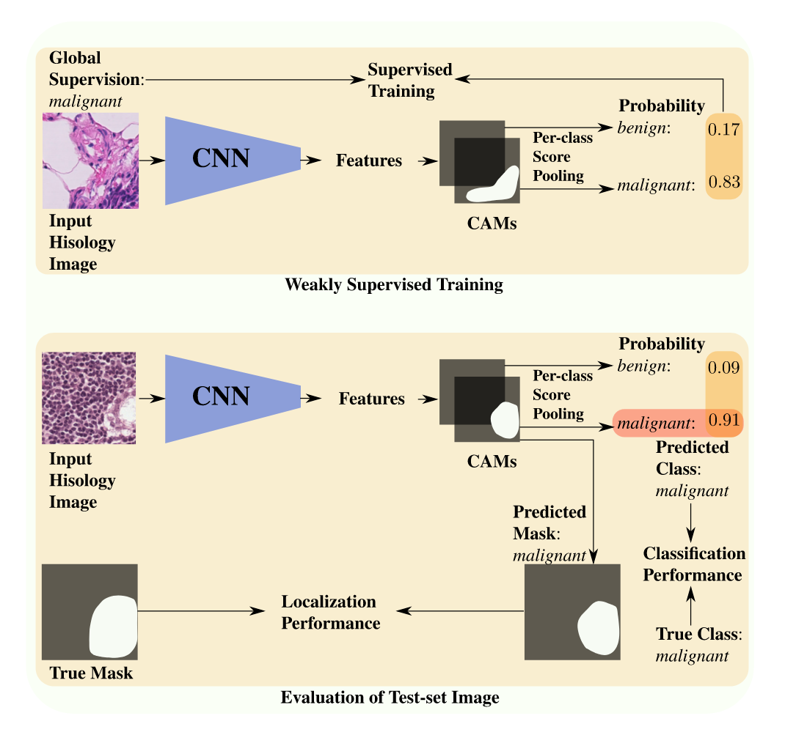
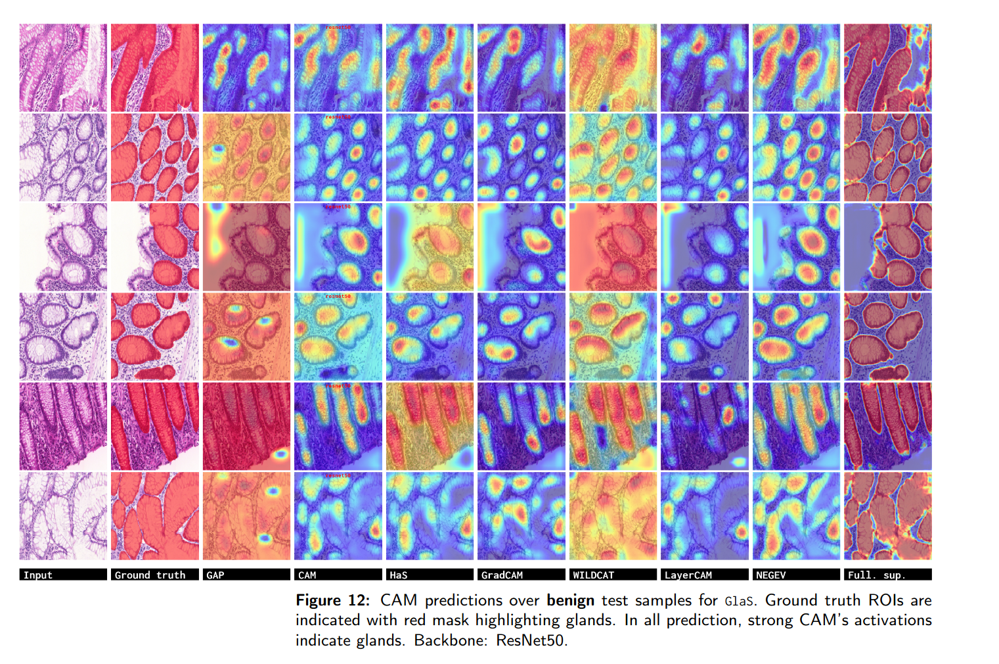
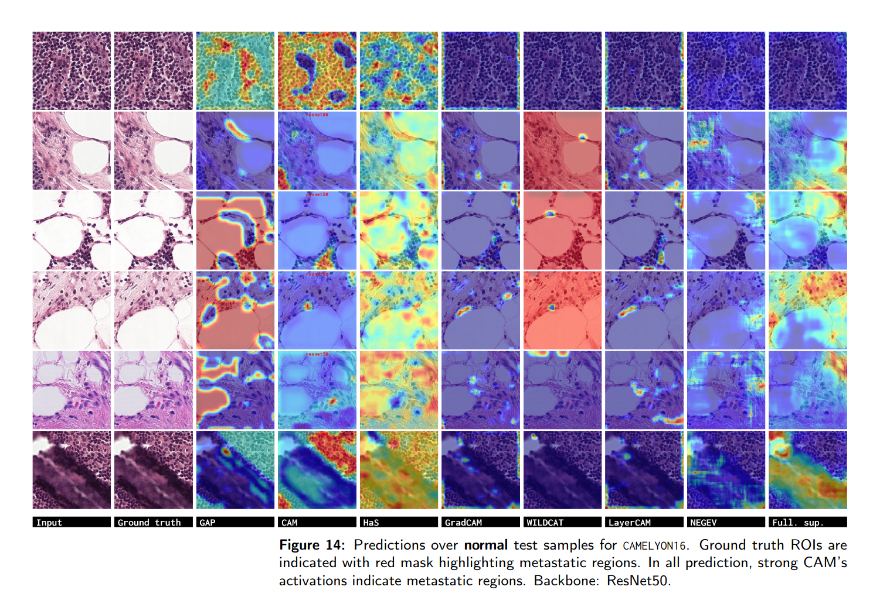

### Pytorch code for WSOL + SFUDA.

Main paper:

`Source-Free Domain Adaptation of Weakly-Supervised Object Localization Models for
Histology`.

### Issues:
Please create a github issue.

### New features (vsb.11.0.0): 
Added `SDDA`, `Domain Impression: A Source Data Free Domain Adaptation Method`
(https://arxiv.org/abs/2102.09003).

**WARNINGS**: Training this method may require a lot of epochs to be able to 
generate good images. It may also require a lot of tweaking of hyper-parameters.
The current version uses a simple CGAN (https://arxiv.org/pdf/1411.1784.pdf) 
which has been trained to generate `28x28` images. It would be better to use 
condtional GANs that yield high resolution images. Most importantly, it is 
better to explore conditional GANs that have been proved efficient in 
generating histology images (https://arxiv.org/pdf/2212.09977.pdf).

New features:

- Cleaned up `main.py`. Kept only necessary things. Loss + optimizer 
  instantiation has been moved into the trainer class.
- `instantiators.get_optimizer()` has been **deleted**. Call instead 
  `instantiators.get_optimizer_of_model()`.
- Added `losses.sf_uda_sdda.py` for all losses of `SDDA` method.
- Added `learning.train_sfuda_sdda_wsol.py` to train `SDDA` method.
- Fixed a bug in `ADADSA` method at `train_wsol.train()`.

### New features (vsb.9.0.0):
- Fixed a bug in `WSOLImageLabelDataset.__get__item()` to retrieve 
  image-class pseudo-labels: `im_pl = self.img_pseudo_labels[image_id]`.
- Added `AdaDSA` method for SFUDA (https://ieeexplore.ieee.org/document/9684410)

### New features (vsb.6.0.0):
- Added config `eval_batch_size`: batch size for evaluation. It helps speedup 
  evaluation mode (sfuda, inference).
- Added config: `spatial_dropout` to be able to perform MC-dropout for 
  FAUST (SFUDA) method. Added to all methods except `METHOD_MAXMIN` since it 
  is not fully supported here.
- `WSOLImageLabelDataset` now return 8 elements instead of 7. the 8th is the 
  views: if applicable it is a torch tensor of dim n+1 view, c, h, w for the 
  non-augmented image, and n views of randomly augmented image. else, it is 
  an int.
- Added `faust.py` for FAUST method.
- Losses:
  - The forward of `ElementaryLoss` now supports a new input argument 
    `key_arg` allowing passing several input at once using adequate key that 
    can change depending on the loss. This prevents overloading the number 
    of arguments of the losses. See `UdaClassProbsViewsSoftLabelsFaust` how 
    to use it.
  - Added [FAUST] `UdaFeatureViewsConsistencyFaust`.
  - Added [FAUST] `UdaClassProbsViewsSoftLabelsFaust`.
  - Added [FAUST] `UdaMcDropoutVarMinFaust`.
  - Added [FAUST] `UdaClassProbsEntropyFaust`.


### Content:
* [View](#view)
<!-- * [Results](#results) -->
* [Requirements](#re2q)
* [Datasets](#datasets)
* [Run code](#run)
* [Notes](#notes)


#### <a name='view'> Method</a>:
<!--  -->


Implemented WSOL methods:
- GAP
- Max-Pooling
- LSE
- CAM
- HaS
- WILDCAT
- ACoL
- SPG
- Deep MIL
- PRM
- ADL
- CutMix
- TS-CAM
- MAXMIN  -- Please use the original implementation https://github.com/sbelharbi/deep-wsl-histo-min-max-uncertainty
- NEGEV
- GradCAM
- GradCAM++
- Smooth-GradCAM++
- LayerCAM
- U-Net

Implemented SFUDA methods:
- SHOT [[paper]](https://arxiv.org/abs/2002.08546)
- FAUST [[paper]](https://arxiv.org/abs/2208.14888)
- AdaDSA [[paper]](https://ieeexplore.ieee.org/document/9684410)
- SDDA [[paper]](https://arxiv.org/abs/2102.09003)

These methods have been integrated with all CAM-based methods except maxmin, 
negev, and fcam. The integration covers all architectures: Resnet50, VGG16, 
InceptionV3.
<!-- 
#### <a name='results'> Results</a>:







 -->


#### <a name='reqs'> Requirements</a>:

Quick installation to create a virtual environment using conda:
```bash
./make_venv.sh NAME_OF_YOUR_VENV
```

* [Full dependencies](dependencies/requirements.txt)
* Build and install CRF:
    * Install [Swig](http://www.swig.org/index.php)
    * CRF (not used in this work, but it is part of the code.)

```shell
cdir=$(pwd)
cd dlib/crf/crfwrapper/bilateralfilter
swig -python -c++ bilateralfilter.i
python setup.py install
cd $cdir
cd dlib/crf/crfwrapper/colorbilateralfilter
swig -python -c++ colorbilateralfilter.i
python setup.py install
```

#### <a name="datasets"> Download datasets </a>:
#### 2.1. Links to dataset:
* [GlaS](https://warwick.ac.uk/fac/sci/dcs/research/tia/glascontest)
* [Camelyon16](https://github.com/jeromerony/survey_wsl_histology)


#### 2.2. Download datasets:

* GlaS: [./download-glas-dataset.sh](./download-glas-dataset.sh).

You find the splits in [./folds](./folds).


### 2.3 Code for datasets split/sampling (+ patches sampling from WSI):
* See [datasets-split](https://github.com/jeromerony/survey_wsl_histology/tree/init-branch/datasets-split).
* Detailed documentation: [datasets-split/README.md](https://github.com/jeromerony/survey_wsl_histology/blob/init-branch/datasets-split/README.md).

#### <a name="run"> Run code </a>:

E.g. SHOT method via CAM WSOL method.

1- Train on source data CAMELYON512:

* CAM-method: CAM over CAMELYON512 using ResNet50:
```shell
#!/usr/bin/env bash 
 
CONDA_BASE=$(conda info --base) 
source $CONDA_BASE/etc/profile.d/conda.sh
conda activate da

# ==============================================================================
cudaid=$1
export CUDA_VISIBLE_DEVICES=$cudaid

export OMP_NUM_THREADS=50
python main.py \
       --task STD_CL \
       --encoder_name resnet50 \
       --arch STDClassifier \
       --spatial_dropout 0.1 \
       --runmode search-mode \
       --opt__name_optimizer sgd \
       --batch_size 32 \
       --eval_batch_size 64 \
       --eval_checkpoint_type best_localization \
       --opt__step_size 5 \
       --opt__gamma 0.1 \
       --max_epochs 20 \
       --freeze_cl False \
       --support_background True \
       --method CAM \
       --spatial_pooling WGAP \
       --dataset CAMELYON512 \
       --fold 0 \
       --cudaid $cudaid \
       --debug_subfolder None \
       --amp True \
       --opt__lr 0.001 \
       --sf_uda False \
       --exp_id 01_12_2024_09_23_52_900932__4871059
```

From the folder of the experiment `01_02_2024_09_23_52_900932__4871059`, 
copy one of the checkpoints folders to the folder `source_models` (constants.
SOURCE_MODELS_FD) located here `./source_models`: 
`CAMELYON512-0-resnet50-CAM-WGAP-cp_best_localization` or 
`CAMELYON512-0-resnet50-CAM-WGAP-cp_best_classification`.

2- Train on target data GLAS: 
#### E.g. of SHOT method.
```shell
#!/usr/bin/env bash 
 
CONDA_BASE=$(conda info --base) 
source $CONDA_BASE/etc/profile.d/conda.sh
conda activate da

# ==============================================================================
cudaid=$1
export CUDA_VISIBLE_DEVICES=$cudaid

export OMP_NUM_THREADS=50
python main.py \
       --task STD_CL \
       --encoder_name resnet50 \
       --arch STDClassifier \
       --spatial_dropout 0.1 \
       --runmode search-mode \
       --opt__name_optimizer sgd \
       --batch_size 32 \
       --eval_batch_size 64 \
       --eval_checkpoint_type best_localization \
       --opt__step_size 5 \
       --opt__gamma 0.1 \
       --max_epochs 1000 \
       --freeze_cl False \
       --support_background True \
       --method CAM \
       --spatial_pooling WGAP \
       --dataset GLAS \
       --fold 0 \
       --cudaid $cudaid \
       --debug_subfolder None \
       --amp True \
       --opt__lr 0.001 \
       --sf_uda True \
       --sf_uda_source_ds CAMELYON512 \
       --sf_uda_source_ds_fold 0 \
       --sf_uda_source_encoder_name resnet50 \
       --sf_uda_source_checkpoint_type best_localization \
       --sf_uda_source_wsol_method CAM \
       --sf_uda_source_wsol_arch STDClassifier \
       --sf_uda_source_wsol_spatial_pooling WGAP \
       --shot True \
       --shot_freq_epoch 1 \
       --shot_dist_type cosine \
       --ent_pseudo_lb True \
       --ent_pseudo_lb_lambda 0.3 \
       --div_pseudo_lb True \
       --div_pseudo_lb_lambda 0.1 \
       --ce_pseudo_lb True \
       --ce_pseudo_lb_lambda 0.3 \
       --ce_pseudo_lb_smooth 0.1 \
       --exp_id 01_12_2024_09_25_14_467534__5485897
```


#### E.g. of FAUST method.
```shell
#!/usr/bin/env bash 
 
CONDA_BASE=$(conda info --base) 
source $CONDA_BASE/etc/profile.d/conda.sh
conda activate da

# ==============================================================================
cudaid=$1
export CUDA_VISIBLE_DEVICES=$cudaid

export OMP_NUM_THREADS=50
python main.py \
       --task STD_CL \
       --encoder_name resnet50 \
       --arch STDClassifier \
       --spatial_dropout 0.1 \
       --runmode search-mode \
       --opt__name_optimizer sgd \
       --batch_size 8 \
       --eval_batch_size 64 \
       --eval_checkpoint_type best_localization \
       --opt__step_size 5 \
       --opt__gamma 0.1 \
       --max_epochs 1000 \
       --freeze_cl False \
       --support_background True \
       --method CAM \
       --spatial_pooling WGAP \
       --dataset GLAS \
       --fold 0 \
       --cudaid $cudaid \
       --debug_subfolder None \
       --amp True \
       --opt__lr 0.001 \
       --sf_uda True \
       --sf_uda_source_ds CAMELYON512 \
       --sf_uda_source_ds_fold 0 \
       --sf_uda_source_encoder_name resnet50 \
       --sf_uda_source_checkpoint_type best_localization \
       --sf_uda_source_wsol_method CAM \
       --sf_uda_source_wsol_arch STDClassifier \
       --sf_uda_source_wsol_spatial_pooling WGAP \
       --shot False \
       --ent_pseudo_lb False \
       --div_pseudo_lb False \
       --ce_pseudo_lb False \
       --faust True \
       --faust_n_views 2 \
       --views_ft_consist True \
       --views_ft_consist_lambda 0.3 \
       --ce_views_soft_pl True \
       --ce_views_soft_pl_t 0.5 \
       --ce_views_soft_pl_lambda 0.3 \
       --mc_var_prob True \
       --mc_var_prob_n_dout 2 \
       --mc_var_prob_lambda 0.3 \
       --min_prob_entropy True \
       --min_prob_entropy_lambda 0.3 \
       --exp_id 01_12_2024_09_25_14_467534__1485898
```

#### E.g. of AdaDSA method.
```shell
#!/usr/bin/env bash 
 
CONDA_BASE=$(conda info --base) 
source $CONDA_BASE/etc/profile.d/conda.sh
conda activate da

# ==============================================================================
cudaid=$1
export CUDA_VISIBLE_DEVICES=$cudaid

export OMP_NUM_THREADS=50
python main.py \
       --task STD_CL \
       --encoder_name resnet50 \
       --arch STDClassifier \
       --spatial_dropout 0.1 \
       --runmode search-mode \
       --opt__name_optimizer sgd \
       --batch_size 8 \
       --eval_batch_size 64 \
       --eval_checkpoint_type best_localization \
       --opt__step_size 5 \
       --opt__gamma 0.1 \
       --max_epochs 1000 \
       --freeze_cl False \
       --support_background True \
       --method CAM \
       --spatial_pooling WGAP \
       --dataset GLAS \
       --fold 0 \
       --cudaid $cudaid \
       --debug_subfolder None \
       --amp True \
       --opt__lr 0.001 \
       --sf_uda True \
       --sf_uda_source_ds CAMELYON512 \
       --sf_uda_source_ds_fold 0 \
       --sf_uda_source_encoder_name resnet50 \
       --sf_uda_source_checkpoint_type best_localization \
       --sf_uda_source_wsol_method CAM \
       --sf_uda_source_wsol_arch STDClassifier \
       --sf_uda_source_wsol_spatial_pooling WGAP \
       --shot False \
       --faust False \
       --adadsa True \
       --adadsa_a 10. \
       --adadsa_eval_batch_size 32 \
       --ent_pseudo_lb True \
       --ent_pseudo_lb_lambda 0.3 \
       --ce_pseudo_lb True \
       --ce_pseudo_lb_lambda 0.3 \
       --ce_pseudo_lb_smooth 0.0 \
       --exp_id 01_12_2024_09_25_14_467534__1485899
```


#### E.g. of SDDA method.
```shell
#!/usr/bin/env bash 
 
CONDA_BASE=$(conda info --base) 
source $CONDA_BASE/etc/profile.d/conda.sh
conda activate da

# ==============================================================================
cudaid=$1
export CUDA_VISIBLE_DEVICES=$cudaid

export OMP_NUM_THREADS=50
python main.py \
       --task STD_CL \
       --encoder_name resnet50 \
       --arch STDClassifier \
       --spatial_dropout 0.1 \
       --runmode search-mode \
       --opt__name_optimizer sgd \
       --batch_size 8 \
       --eval_batch_size 64 \
       --eval_checkpoint_type best_localization \
       --opt__step_size 5 \
       --opt__gamma 0.1 \
       --max_epochs 1000 \
       --freeze_cl False \
       --support_background True \
       --method CAM \
       --spatial_pooling WGAP \
       --dataset GLAS \
       --fold 0 \
       --cudaid $cudaid \
       --debug_subfolder None \
       --amp True \
       --opt__lr 0.001 \
       --sf_uda True \
       --sf_uda_source_ds CAMELYON512 \
       --sf_uda_source_ds_fold 0 \
       --sf_uda_source_encoder_name resnet50 \
       --sf_uda_source_checkpoint_type best_localization \
       --sf_uda_source_wsol_method CAM \
       --sf_uda_source_wsol_arch STDClassifier \
       --sf_uda_source_wsol_spatial_pooling WGAP \
       --shot False \
       --faust False \
       --adadsa False \
       --sdda True \
       --sdda_gan_type CGAN \
       --sdda_gan_latent_dim 100 \
       --sdda_gan_h 128 \
       --sdda_gan_w 128 \
       --adaptation_start_epoch 25 \
       --sdda_d__name_optimizer sgd \
       --sdda_d__lr 0.001 \
       --sdda_d__name_lr_scheduler mystep \
       --sdda_d__step_size 5 \
       --sdda_d__gamma 0.1 \
       --adv_d_sdda True \
       --adv_d_sdda_lambda 1. \
       --adv_g_sdda True \
       --adv_g_sdda_lambda 1. \
       --px_sdda True \
       --px_sdda_lambda 1. \
       --ce_src_m_fake_sdda True \
       --ce_src_m_fake_sdda_lambda 0.1 \
       --ce_trg_m_fake_sdda True \
       --ce_trg_m_fake_sdda_lambda 0.1 \
       --ce_dom_d_sdda True \
       --ce_dom_d_sdda_a 10. \
       --exp_id 01_12_2024_09_25_14_467534__2485876
```

#### <a name='notes'> Notes</a>:

1. Usage of the class `WSOLImageLabelDataset` for only a selected subset of 
samples: This is better used for SFUDA case. The standard usage with `all 
samples` is to call `get_data_loader(..
., per_split_sfuda_select_ids_pl=None)`. Whatever the `split` (train, valid, 
test, ...), and the `mode` (train, eval), all the samples are considered.
Assume that for the trainset split, one want to create a dataset only with a 
preselected samples. Samples are identified using unique ID. First, we need 
to determine which samples. This is an independent process. E.g. 
```python
loaders = get_data_loader(..., get_splits_eval=[constants.TRAINSET], 
                         per_split_sfuda_select_ids_pl
=None)  # this will load the entire trainset in eval mode
trainset_loader = loaders[constants.TRAINSET]
# forward the images into a frozen model
# perform clustering, pseudo-labeling of images classes.
# select only few samples, and their image-class pseudo-labels.
selected_train_samples = {
  'id1': 0,  # key: id, val: int, image-pseudo-label.
  'id2': 1
}
# recreate a new trainset (for training for example) using only selected samples
loaders = get_data_loader(..., get_splits_eval=None, 
                         per_split_sfuda_select_ids_pl={constants.TRAINSET: selected_train_samples})
trainset_loader = loaders[constants.TRAINSET]  # a trainset with train mode that has only 
# selected samples with id1, id2. 
```

It is recommended to use branches >= vsb.3.0.0 since we dropped support for dpp.


2. How to access source features at loss class? one way is to assign the 
   variable: `model.src_ft = source_features`.
   1. First compute `source_features`.
   2. Assign: `model.src_ft = source_features.detach()`, detach from graph.